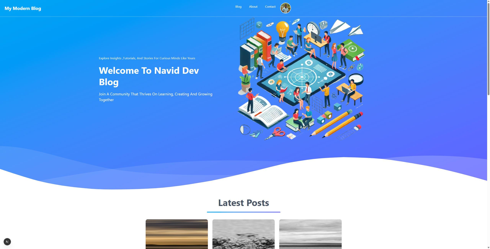

## A Blog website using NestJs and NextJs connected together with Turborepo.
Fill these env variable :
DATABASE_URL - GOOGLE_CLIENT_ID - GOOGLE_CLIENT_SECRET - GOOGLE_CALLBACK_URL - SUPABASE_URL - SUPABASE_API_KEY

یک وبسایت بلاگ با استفاده از NextJs و NestJs که با Turborepo بهم متصل شدند.

## 📸 Screenshots

  
  
  

